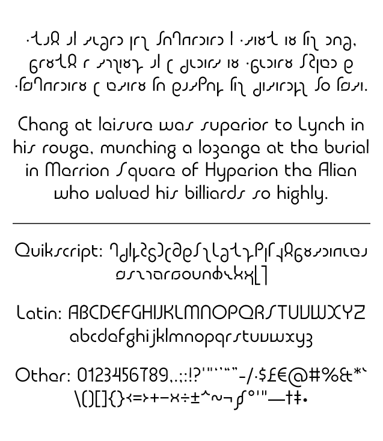

# Quasar

These fonts contain the complete Quikscript alphabet in its community-standard Private Use Area encoding, plus a few other punctuation marks and symbols necessary for typesetting simple documents in English.

This is my take on a Bauhaus-style geometric typeface. It was a bit of a stretch to make this one fit my naming scheme of words beginning with Q; I settled on “Quasar”, as that term not only evokes space age retrofuturism, but serves as an excellent demonstration of the font’s design characteristics. A key design principle was to avoid diagonal lines, often leading to the use of curves in their place—note the handwritten-style letters x, y and z.

Quikscript is already known for having several letters that are simple reflections or rotations of others, like Age and Ice. The strict geometric construction of Quasar created a few more such instances, like Zhivago, Mime, Fife and Valve. The self-imposed ban on diagonals resulted in Win-win and Whitewheat becoming completely vertical, and therefore simple transformations of Tut and Deed, respectively. I originally wanted Thoth and Thither to be a reflection and translation of Shush, respectively, but this would have resulted in confusion between Thoth and Pipe, so I opted for a symmetrical design for them.

Weights range from thin to black. Those two “master” weights were drawn in FontForge, with everything in between being interpolated by Fontmake. Variable fonts are available. The static (individual weight) fonts have hinting applied, however, so they may look nicer on-screen in Windows.

Alternate forms of the letters g and w/W are accessible through the Stylistic Set 1 and Stylistic Set 2 OpenType features, respectively; alternate forms of Age, Ice, Oil and Out are accessible via Stylistic Set 3. The Stylistic Alternates feature activates all of these at once.

In addition to the various weights, Quasar comes in two variants:

- Classic: with small openings in the counters of letters like a, b, g, et cetera; much like the 20th-century typefaces that inspired this one.
- Regular: with conventional, closed counters in those letters, lending this style a more contemporary look. This results in a kind of “Latinised” appearance for the Quikscript letters Bob/Fife/Valve/Zhivago/Yo-yo/Mime, since their counters are now circular rather than closing the loop at the baseline or x-height, as they do in handwriting.

## Software requirements

- Ensure Python and FontForge are installed, and are in your PATH environment variable (so they can be invoked from the command line).
- From the root of the repo, run the command `pip install -r requirements.txt` to install the necessary Python packages.

## Building

To build the fonts from scratch, using the provided Windows batch files, run `build.bat`; this produces the intermediate source in UFO format and then builds the final OpenType (TTF and WOFF2) fonts. If you wish, run `test.bat` to see Font Bakery's test results for the fonts.
